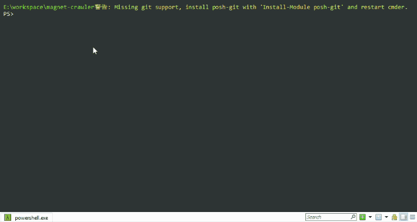

# magnet-crawler 磁力链接收集器

## 简介

这是一个 magnet 爬虫，通过伪装成一个 DHT 节点，接收其他节点发过来的请求信息，提取相关的 magnet。
然后通过 [Aria2](https://aria2.github.io/) 的 RPC 特性调用下载，把 magnet 下载为种子(torrent)，
并解析种子文件信息，把文件信息存入数据库。



## 环境依赖

- Python 3
- Redis
- Aria2

## 安装

```
git clone https://github.com/Cyrus97/magnet-crawler.git
cd magnet-crawler
pip install -r requirements.txt
```

## 配置

### Aria2 RPC

需要开启 Aria2 的 RPC 功能，默认使用的是 6800 端口。关于 Aria2 的相关设置，
请到文件 [magnet2torrent.py](magnet_crawler/magnet2torrent.py) 中同步修改。

```python
# file magnet_crawler/magnet2torrent.py

RPC_SERVER = "http://localhost:6800/rpc"
RPC_WEBSOCKET = "ws://localhost:6800/jsonrpc"
# 把 token: 后面换成你的 secret
RPC_SECRET = "token:abcdefg"
# aria2 下载timeout
BT_STOP_TIMEOUT = 600
# aria2 最大下载数量
MAX_DOWNLOADS = 32
# aria2 下载路径
DIR_PATH = os.path.abspath('./torrents')
```

### Redis

使用默认的 6379 端口，要修改请到文件 [database.py](magnet_crawler/database.py) 中修改。

```python
# file magnet_crawler/database.py

# redis config
REDIS_HOST = '127.0.0.1'
REDIS_PORT = 6379
# 所有的magnet存在这里
REDIS_ALL_KEY = 'all-magnet'
# 进行过转换的magnet
REDIS_USED_KEY = 'used-magnet'
# 能下载的magnet
REDIS_AVAIL_KEY = 'magnet'
```

## 使用

```
# python run.py -h

usage: run.py [-h] [-c COUNT] [-p PORT] [--only-crawler] [--only-convert]
              [runserver] [createdatabase]

run for magnet-crawler

positional arguments:
  runserver             启动
  createdatabase        创建数据库

optional arguments:
  -h, --help            show this help message and exit
  -c COUNT, --count COUNT
                        指定爬虫进程数
  -p PORT, --port PORT  指定爬虫绑定端口起始位置
  --only-crawler        只运行爬虫
  --only-convert        只运行 magnet 转换

```


## 快速开始

```python
# 创建数据库
python run.py createdatabase

# 以默认方式启动（启动爬虫和 magnet 下载转换）
python run.py runserver

# 如果你只是想跑跑看，或者没有下载 redis 和 aria2 可以只启动爬虫
python run.py runserver --only-crawler

```

## 问题

有任何使用问题或者建议请提 Issue，或者发给我邮件 `liuxingran97@gmail.com`。

### 已知问题

- 在命令行运行该程序无法使用 `Ctrl + C` 退出，只能关闭命令行程序（是因为多进程多线程的原因，正在解决）
- 可能在使用 Aria2 RPC 发送和接收信息过程中出错

### 其他问题

- 如果是在本地（没有公网）运行，有可能会出现一直爬取不到任何信息的问题，需要重新连接网络（重新拨号）

## TODO

- [ ] 修复 bug
- [ ] 优化多进程和多线程
- [ ] 优化 magnet 转 torrent的逻辑，更好地对接 Aria2 和 数据库
- [ ] 分析爬取到的内容
